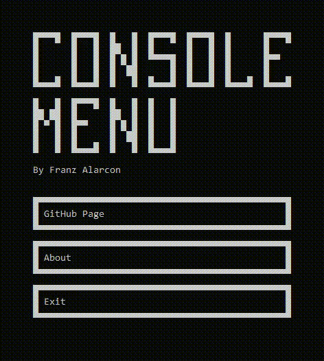

ConsoleMenu (CONU) is a C++ GUI library for creating visual applications in the Windows default console. CONU is purpose-built for creating clickable menu systems within applications with support for real-time 2D interactive programs, such as basic games and drawing canvases. 

# Quickstart Guide
The CONU [quickstart guide](https://docs.google.com/document/d/1iKMQI_5z-xb1Jxoke-HaIryZRz2Btgbtw02dYN7yWg4/edit?usp=sharing) is an available resource for getting started with the CONU library. The document provides instructions for installing and setting-up the library, and it provides an overview of important library operations and objects.

# Demonstrations
### BasicMenu Program

    

### AsciiPainter Program

    

